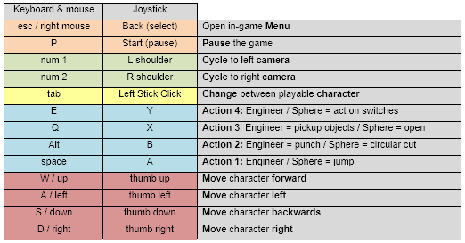
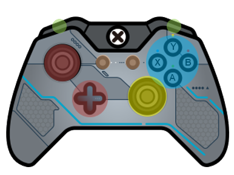
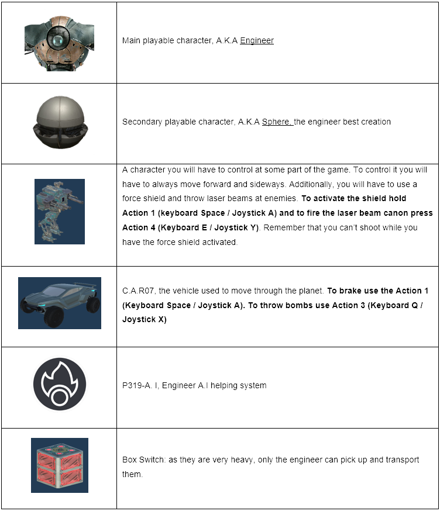
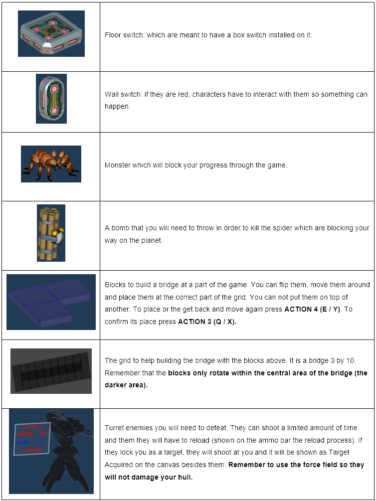

# INTO THE UNKNOWN - UNITY ENGINE PROJECT #

#######################################################################

Build - https://philipego.itch.io/into-the-unkown

#######################################################################

## 7378-Team-I-2020 ##

- 420-JV9-AS - GAME ENGINE II

### Professor: ###

- Marc-Andre Larouche

### Development Team: ###

- Philipe Gouveia

- Sohyun Yi

- Sidakpreet Singh

#######################################################################

**Section 1: About the Game**

      Into the Unknown is a puzzle game with a Sci-Fi history atmosphere. In the game the player can control two main characters to solve puzzles throughout all the stages. 
      Aside from the main characters, there is one vehicle which can be used to move from one land station to another. On each of the stations the player will find puzzles to be solved in order to understand the game and to figure out the mystery about the planet. At parts of the game the player might be challenged to take decisions that can alter the end of the game.
      The game happens on the year 287 D.M. The A.I, built by the main character, informs him that, for an UNKNOWN reason, they were switched off for about 13 years, as its database has no data within this time gap. 
      The mystery lies there, as the last thing the A.I remembers is when the engineer has successfully built the sphere, the second playable character. 
      In addition, the only thing the A.Is sensor can detect is a weak radio signal from a nearby land station. What it might be? 
      
**Section 2: About the Manual**

      2.1 - Control Scheme:

      2.2 - Important Visuals:
      

**Section 3: Development Process**

https://trello.com/b/18JjtMkI/7378-teami-2020

**Section 4: References**

*4.0 - Game Design*

-by Phil go, https://github.com/philipe-go

-by Sohyun Yi, https://github.com/s2ohyun

-by Sidakpreet Singh, https://github.com/Sidak27

*4.1 - Graphical Designs*

-Game Studio Logo Design:
by Phil Go, https://github.com/philipe-go

-Game icon Design:
by Phil go, https://github.com/philipe-go

-Engineer Character Design:
by Papa_Dragon, http://www.blendswap.com/blends/view/75153.

-Sphere Character Design:
by 3DHaupt, https://www.blendswap.com/blend/21770

-Car Vehicle Design:
by Mikel007, http://www.blendswap.com/blends/view/77885

-Mech Robot Design:
by Triplebrick, https://assetstore.unity.com/packages/3d/characters/robots/the-assault-mech-90395

-Keyboard icon:
by hxtremechaos, https://www.deviantart.com/hxtremechaos/art/Hexagon-Keyboard-494072667

-Joystick icon:
SihanLiu, https://www.iconfinder.com/icons/1536922/controller_elite_gamer_xbox_one_icon

-In-Game Font:
Earth 2072 by Lukas Krakora, http://www.typewriterfonts.net

-Environmental assets:

3D Sci-fi Starter Kit, https://assetstore.unity.com/packages/3d/environments/3d-scifi-kit-starter-kit-92152

Sci-Fi Modular Pack, https://assetstore.unity.com/packages/3d/environments/sci-fi/sci-fi-modular-pack-free-39538

3D Free modular kit, https://assetstore.unity.com/packages/3d/environments/3d-free-modular-kit-85732

Modular Sci-Fi Corridor, https://assetstore.unity.com/packages/3d/environments/sci-fi/modular-sci-fi-corridor-142811

Sci-Fi Styled Modular Pack, https://assetstore.unity.com/packages/3d/environments/sci-fi/sci-fi-styled-modular-pack-82913

Modular Sci-Fi Corridor, https://assetstore.unity.com/packages/3d/environments/sci-fi/modular-sci-fi-corridor-142811

Sci-Fi Styled Modular Pack, https://assetstore.unity.com/packages/3d/environments/sci-fi/sci-fi-styled-modular-pack-82913

Terrain Tools, by MGEAR, https://assetstore.unity.com/packages/tools/terrain/terrain-tools-64852

Hi-Rez Spaceships Creator Free Sample, by Ebal Studios, https://assetstore.unity.com/packages/3d/vehicles/space/hi-rez-spaceships-creator-free-sample-153363

SpaceShip Free Model, by thomasmattia, https://free3d.com/ko/3d-model/spacecraft-54534.html
Space Station Scene, by 3dhaupt, https://free3d.com/ko/3d-model/spacestation-scene-520279.html

Sci-Fi TopDown view Pack, https://assetstore.unity.com/packages/3d/environments/sci-fi/top-down-scifi-modular-environment-100524

-Skybox for space: 
SpaceSkies Free, by PUSAR BYTES, https://assetstore.unity.com/packages/2d/textures-materials/sky/spaceskies-free-80503

-Bomb design: 
by Yughues Free Bomb, by Nobiax / Yughues, https://assetstore.unity.com/packages/3d/props/weapons/yughues-free-bombs-13147

-Particle Systems:
Explosion - by Unity Particle Pack, by Unity Technologies, https://assetstore.unity.com/packages/essentials/tutorial-projects/unity-particle-pack-127325

-Spider Design:
By Kalamona, https://assetstore.unity.com/packages/3d/characters/creatures/free-fantasy-spider-10104

-Spider Web Design: 
by Vul Gerstal, [TUTORIAL] https://www.youtube.com/watch?v=kMM9q0I8mFE, https://www.youtube.com/watch?v=4cQoSpV0-MQ

-Door Design:
By Highground Assets, https://assetstore.unity.com/packages/3d/environments/sci-fi-environment-84496

-Engineer Robot Background:
by Papa_Dragon, http://www.blendswap.com/blends/view/75153.

-Bomb explosion:
Throwing and add particle system to the bomb: GRENADES / BOMBS 
by Brackeys [TUTORIAL] https://www.youtube.com/watch?v=BYL6JtUdEY0

*4.2 - UI Design*
-In-Game UI:
SlimUI, https://assetstore.unity.com/packages/tools/gui/slimui-tech-menu-133049

*4.3 - Sound Effects and Musics*

-Background Main Menu Music:
by Sound Engineer Champollion, instagram: @champs.music 

-Background Stages Music Pack:
by Robson Cozendey, https://www.cozendey.com

Planet by marcelofg55, https://opengameart.org/content/sci-fi-textures

-SFX package I:
by Sound Engineer Champollion, instagram: @champs.music

-SFX package II:
by Game Epic Media, http://epicstockmedia.com

-Explosion sound: 
explosion sounds, by Unnamed https://opengameart.org/content/9-explosion-sounds

-Spider Dead sound:
Ghost by marcelofg55, https://opengameart.org/content/ghost
